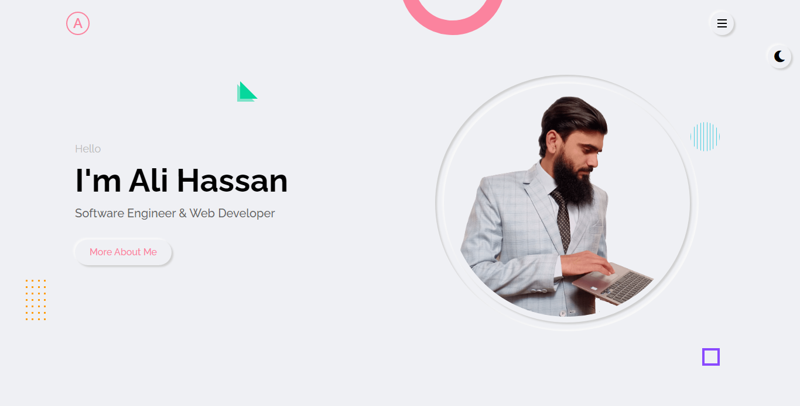
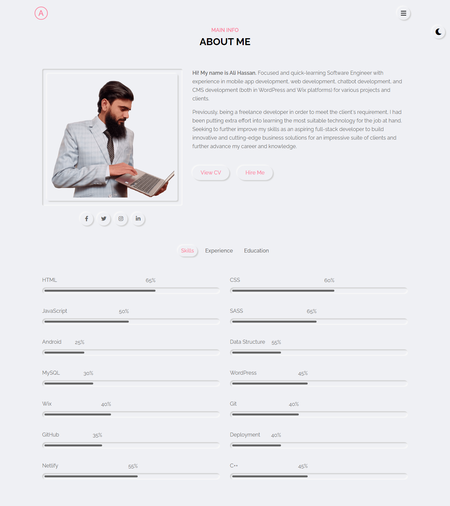
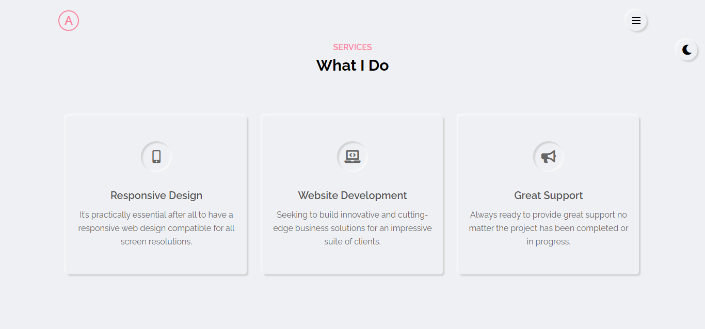
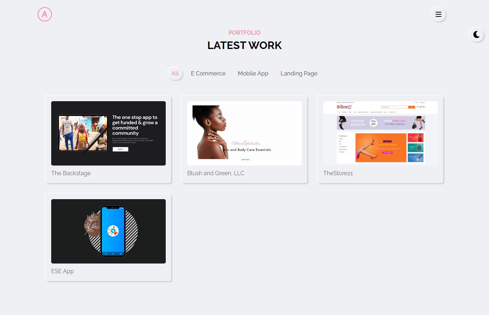
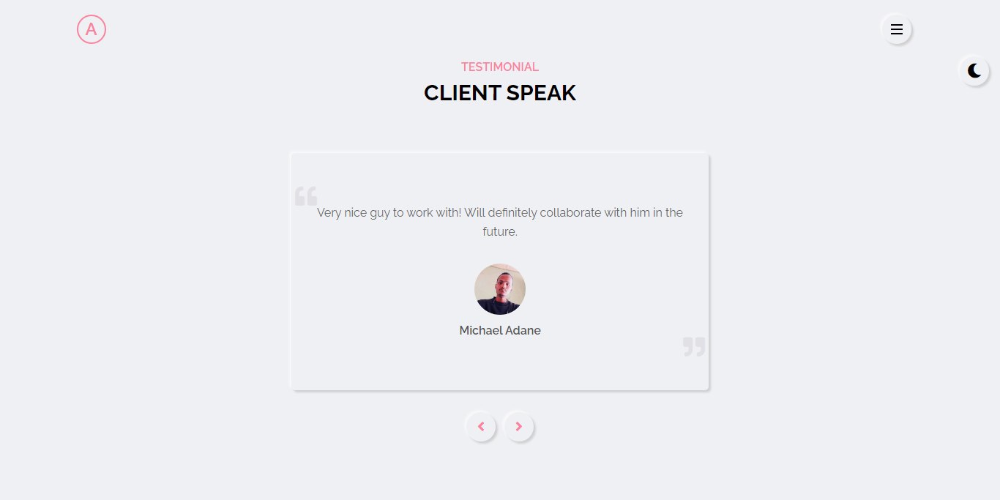
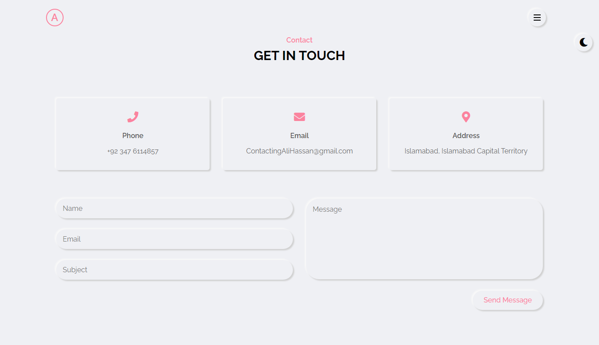

# Personal Portfolio Website Html Css Javascript

It is a fully responsive personal, portfolio, resume template that consists of 5 colors, Light and Dark demos. It has many features of a business website. Upvesh is a simple, modern, creative and responsive template. It will help you to presents yourself or your business resume more smartly and easily. This is built with HTML5, CSS3, JAVASCRIPT. It’s 100% responsive with clean codes. All components used in the template are well commented, w3 validated and are well documented.

## Previews

| Home                                                | About                                                  | Services                                                        |
| --------------------------------------------------- | ------------------------------------------------------ | --------------------------------------------------------------- |
|  |  |  |

| Portfolio                                                        | Blog                                                                        | Contact                                                      |
| ---------------------------------------------------------------- | --------------------------------------------------------------------------- | ------------------------------------------------------------ |
|  |  |  |

## Demo

- [Upvesh](#)

## Tutorial

- [The WebShala](#)

if you watch this full tutorial you will learn lot of things.

What has been learned :

- Responsive Layout
- 5 Color Skins
- Light/Dark
- Smoooth transitions
- Live Style Switcher
- Clean Code
- W3C Validated
- HTML5 & CSS3 & JAVASCRIPT
- Cross Browser Compatible
- 100% Customizable, all colors can be customized
- Project Image Format
- Font Awesome Icons
- Well-commented code
- Google Fonts
